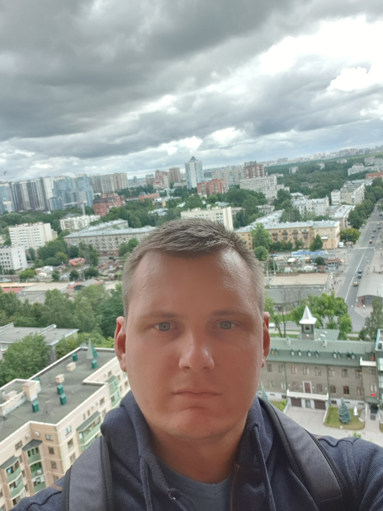

- Name: **Vitali Khlinski**  
  
- Contact details:
  - Discord: _Vitaliy (@VitaliKhilinski)_
  - Mob: +375(33)628-20-20
  - Email: v.khilinski@gmail.com
- About me: _My main goal is to become a professional in the field of front-end development. Learn English to level C1 and just be a good person. My strength is to finish everything I started._
- Skills: basic JavaScript, HTML, CSS.
- code examples:

```
function number(pair) {
 let set = new Set(pair);
 let count = 0;
 for (let value of set) {
   count += parseInt(pair.filter((i) => i == value).length / 2);
 }
 return count;
}
```

- Completed stage0 of the course RSchool. Higher education.
- English level: **B1**
